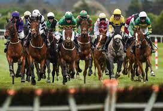
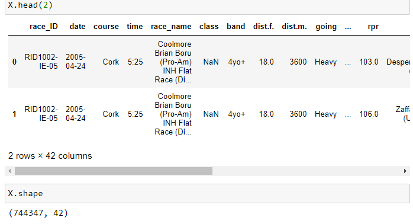
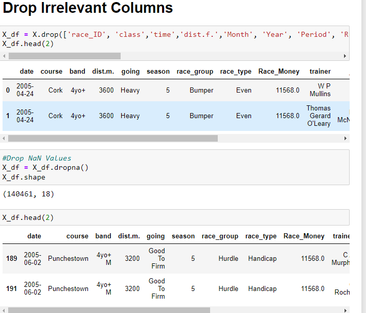
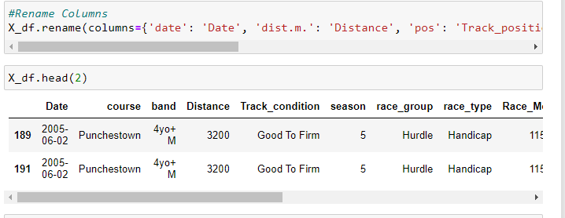
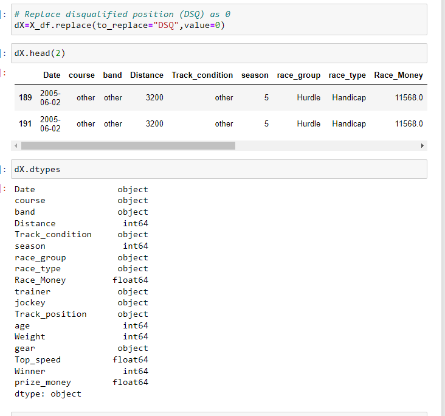
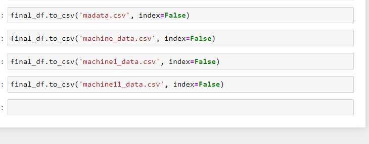

# Project 4
## TRAIN AN ALGORITHM TO ANALYZE HORSE RACING DATA AND PREDICT FUTURE TRENDS

### A.Sheikh - C Mafavuke - M Ansah - M Amjad

## INTRODUCTION
Our group has identfied that there is a scope to develop a model which combines both fundamental features of racing horses and market generated information.

Our aim is to develop a model which combines both fundamental and market-generated information. The combining of information in a one-step model provides simplicity and also the opportunity to explore the significance of each individual fundamental variable in an explicit manner; since probabilities derived from the final market odds also appear in the model.

## RESOURCES
* Kaggle
* Jupyter Notebook
* PG Admin

## DATA COLLECTION
Data was obtained from kaggle as a csv file.
The csv file included 42 columns and over 744 thousand rows of data initially.The data was cleaned with Pandas on Jupyter Notebook. Google colab was considered as a choice of Juypter notebook, as the local machine would not support the size of the CSV file data, however, there were a lot of limitations with this application and it ran out of free space so the Jupyter Notebook route was followed. 

The csv file included horse racing history between 2005 and 2019. Data was made up of the horse winning history, track conditions, distance, horse parentage, horse weight, age, racing group, time of the year/season the races took place etc 

DEFINITIONS OF THE INDEPENDENT VARIABLES EMPLOYED IN THE MODELS 
Independent variable Variable definitions Market-generated 
variable ln ðpsij ÞThe natural logarithm of the normalised final odds probability Fundamental variables 
pre_s_ra Speed rating for the previous race in which the horse ran 
avgsr4 The average of a horse’s speed rating in its last 4 races; 
zero when there is no past run draw 
Post-position in current race eps 
Total prize money earnings (finishing first, second or third) to date/
Number of races entered 
newdis 1 indicates a horse that ran three or four of its last four races at a distance of 80% less than current distance, 0 otherwise 
weight Weight carried by the horse in current race 
win_run The percentage of the races won by the horse in its career 
jnowin The number of wins by the jockey in career to date of race 
jwinper The winning percentage of the jockey in career to date of race 
jst1miss 1 indicates when the other jockey variables are missing; 0 otherwise 
(THE JOURNAL OF PREDICTION MARKETS2007, 1 1)

---------------------

1) Why use this data

A: this is the only viable data available on this topic. we chose to use the data for UK and Ireland as a lot of data was available..

2) Steps taken to clean
PANDAS

Data size was reduced.

3) which machine learning?
Wanted to try if  we can use Keras Tuner, but could not use as the installation process was failing.
Tried - DT , logistic regression

4) steps taken for creating model

5) Steps taken to sample

..........................
Once we have the final DF.....We propose to create various columns for furture users to pick and choose from.

6) which D/B to use 

SQL

+++++++++++++++++++++++++++++++++++++++++++++++++++++++
## RAW DATA PROCESSING & CLEANING

Jupyter Notebook was utilised to access the raw data from the CSV files.
The required dependencies were imported:

pandas as pd
numpy as np
pandas as pd

LogisticRegression
pyplot as plt
seaborn as sns
StandardScaler, MinMaxScaler, LabelEncoder
train_test_split
DecisionTreeClassifier, plot_tree
metrics
preprocessing
RandomForestClassifier
make_classification

Initial review of the CSV file showed that there were over 700K rows across 42 columns.
A 'for loop' was run to identify the unique categories across the columns.

A further review of the column data was performed and those features that weren't required in the model such as: 
'race_ID', 'class','time','dist.f.','Month', 'Year', 'Period', 'Runners','fin_time', 'dec','weight','dec_clean','sire', 'dam', 'damsire', 'comment','race_name','btn','sp','or','rpr','horse_name','exp_chance','prob',
were removed. Feature selection was based on elements in the data that contirbuted most to the prediction variable or output that we are interested in. Having irrelevant features in the data could decrease the accuracy of the model, especially the logistic regression that we are using. Our selection of features before modeling the data was to reduce overfitting, improve accuracy and reduce training time.

The columns in the dataframe were renamed for ease in understanding their meanings.

Based on the various columns explored, it is clearly necessary to develop a model which combines both fundamental features of each horse and market generated information.

The number of unique values was reduced by binning 'rare' categorical variables on:
1. band
2. jockey
3. trainer
4. track condition  

The raw data size was reduced to under 150K rows over 18 columns.
Further cleaning of the data was performed by reducing categorical variables (band) and non numerical values to a numerical value in the btn (beaten) column. 

The final cleaned dataframes were converted and exported as a CSV file.

+++++++++++++++++++++++++++++++++++++++++++++++++++++++++++

## MACHINE LEARNING DATA PROCESSING

Jupyter notebook was utilised to further prepare the data and 

